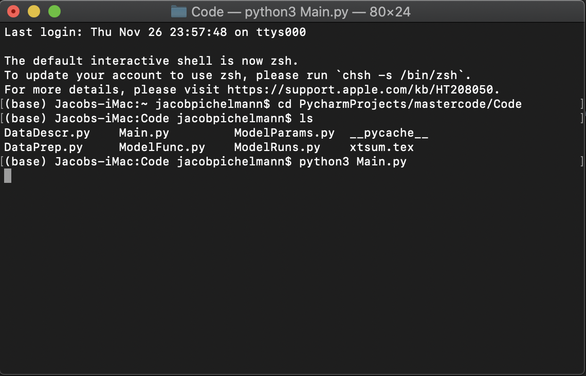
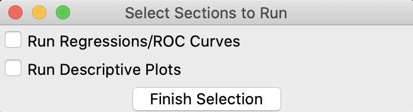
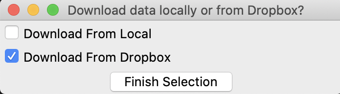

# Panel Data Project 2020

* **Andrew Boomer**

* **Jacob Pichelmann**

* **Luca Poll**

## Getting Started

1. Unpack the zip folder in the directory you want to store the code in.
2. The code can be executed in two ways: 
    1. Use your editor of choice and run the script Main.py.
    2. Run Main.py straight from the terminal by first navigating to the code folder
    using 'cd yourchoiceofdirectory/mastercode/Code' and then executing the code by
    typing either 'python3 Main.py' or 'python Main.py' depending on your executable. 
    
    

### Prerequisites

* Python 3.8 needs to be installed on your machine in order to be able to execute the code.

* All additional libraries used will be installed automatically when executing the program.

## Code Execution

Executing Main.py prompts two selection windows. 
1. Choose what part of the code you want to run, either the regressions and ROC curves or
the descriptive plots. 

2. Choose the source of the data download (for ease of use please selection option 'Download From Dropbox)

This is all that has to be done. The console output will inform you about the progress and all results
will be stored in the 'Report' folder. 

## Versioning

We use bitbucket to version the code. Prior commits can be obtained from 
https://bitbucket.org/aboomer07/mastercode/commits/ (bitbucket account necessary). 